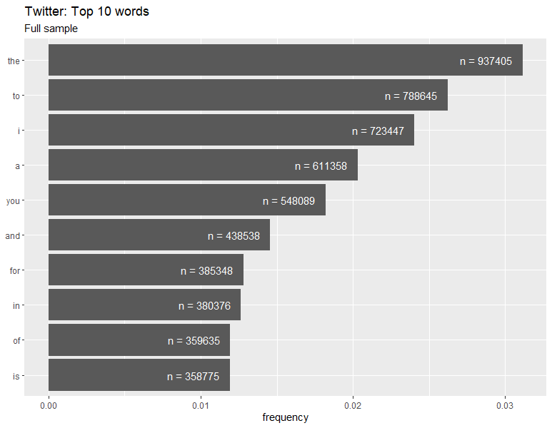
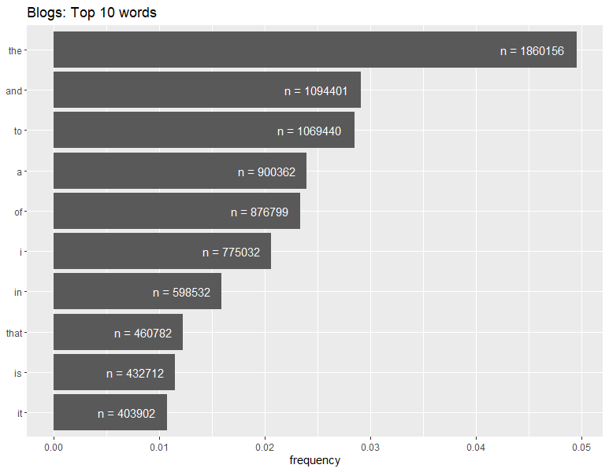
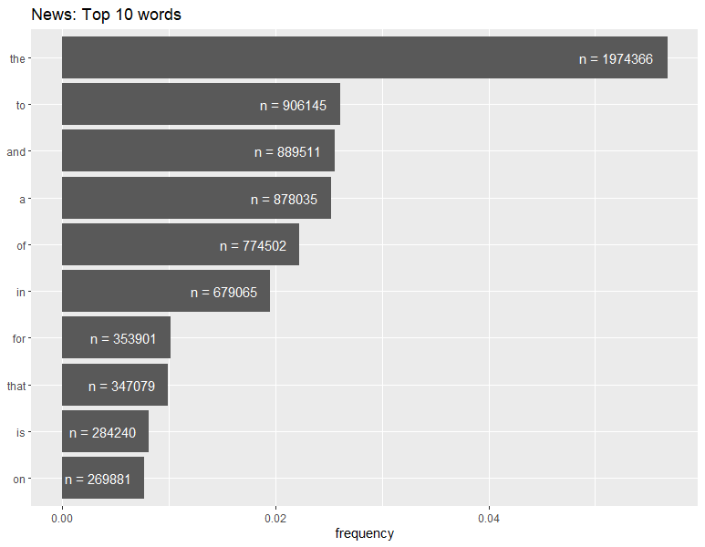
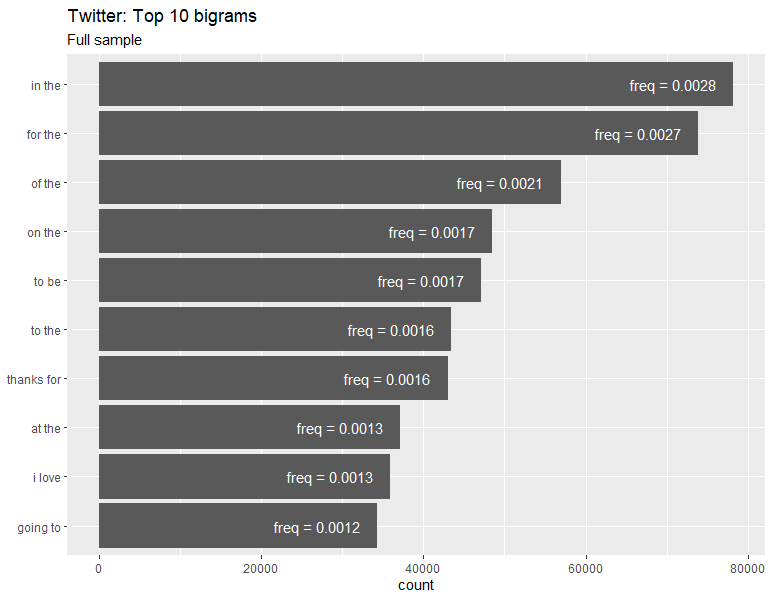
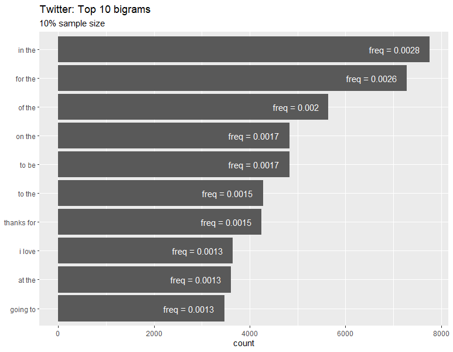
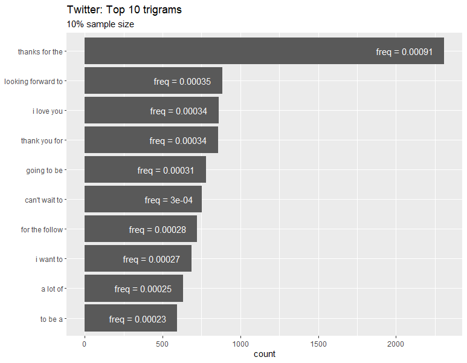

```{r setup, include=FALSE}
library(knitr)
library(tidyverse)
library(tidytext)

knitr::opts_chunk$set(echo = TRUE)

```

## Introduction

This milestone report will provide some update on the project. It uses the
tidytext package from authors David Robinson and Julia Silge.

## Data 

There are 3 data sets provided - from twitter, from blogs, and from news feeds.
The files are unstructured in the sense that each line holds a single chunk of
text of variable length.

### Loading

Data is read with readr::read_lines which preserves the structure (lines of
text). The function allows to limit the number of lines read systematically or
via random draws. This will come handy when developing the application as the
full data sets are rather large. However, for the milestone report the full sets
will be started with.

Specific path and file names are set to load all 3 data files for further
analysis.

```{r load, echo=TRUE}

# assign paths and file names
setwd("~/Coursera/Scripts and Data/Capstone")
data_dir <- file.path(getwd(), "datasets", "final", "en_US")

tw_file_name <- "en_US.twitter.txt"
bl_file_name <- "en_US.blogs.txt"
nw_file_name <- "en_US.news.txt"

# read the data 
twitter_data <- read_lines(paste0(data_dir, "/", tw_file_name),
                           skip_empty_rows = TRUE)
blogs_data <- read_lines(paste0(data_dir, "/", bl_file_name),
                   skip_empty_rows = TRUE)
news_data <- read_lines(paste0(data_dir, "/", nw_file_name),
                   skip_empty_rows = TRUE)

```

```{r include=FALSE}

# prepare a tibble
mytable1 <- tribble(
        ~data_source, ~number_lines,
        tw_file_name, length(twitter_data),
        bl_file_name, length(blogs_data),
        nw_file_name, length(news_data)
        )

```

```{r echo=FALSE}

kable(mytable1, 
      caption = "Table1: Raw data overview", 
      col.names = c("Source file","Lines read"), 
      format.args = list(big.mark = ",", scientific = FALSE))

```

### Processing

The first step is to "tokenize" each data set (corpus) into smaller pieces,
starting with words and then progressing to bigrams (groups of 2 words) and
trigrams (3 words).

We start at the word level which to analyze count and later frequency of words
in each corpus.

Using the tokenization process provided with the tidytext package immediately
strips punctuation while converting all letters to lower case. In order to
reduce the number of words to "real" words we additionally remove all words that
do not start with a letter.

```{r tokenization, echo=TRUE}

# prepare tibbles 
tw_text <- tibble(line = 1:length(twitter_data), text = twitter_data)
bl_text <- tibble(line = 1:length(blogs_data), text = blogs_data)
nw_text <- tibble(line = 1:length(news_data), text = news_data)

# tokenize these tibbles - separate into words 
tw_words <- tw_text %>% 
  unnest_tokens(word, text) %>%
  filter(str_starts(word, "[a-z]") == TRUE)
bl_words <- bl_text %>% 
  unnest_tokens(word, text) %>%
  filter(str_starts(word, "[a-z]") == TRUE)
nw_words <- nw_text %>% 
  unnest_tokens(word, text) %>%
  filter(str_starts(word, "[a-z]") == TRUE)

```

For some kind of analysis the removal of so-called stop words is recommended.
Stop words are the most common words like "the", "of", "to", etc. which may not
add much value in certain analyses. In our case, removing these stop words may
be very counter-productive given the attempt to build a tool to predict the next
word.

## Exploratory Analysis

Table 2 shows the total number of words extracted from each corpus.

```{r table2, include=FALSE}

# prepare tibble
mytable2 <- tribble(
        ~data_source, ~total_number_words, 
        "twitter", nrow(tw_words), 
        "blogs", nrow(bl_words), 
        "news", nrow(nw_words)
        )


```

```{r echo=FALSE}

kable(mytable2, 
      caption = "Table2: Total number of words", 
      col.names = c("Source", "Total words"), 
      format.args = list(big.mark = ",", scientific = FALSE))

```

Given the much larger number of lines in the twitter data there are comparably
few words. This is likely caused by twitter's limited number of characters per
post.

In a next step we report the number of unique words and sort them by frequency.

```{r further_tokenization, echo=TRUE}

# add unique word count 
tw_words <- tw_words %>%
        count(word, sort = TRUE)
bl_words <- bl_words %>% 
        count(word, sort = TRUE)
nw_words <- nw_words %>% 
        count(word, sort = TRUE)

```

```{r table3, include=FALSE}

# prepare tibble
mytable3 <- tribble(
        ~data_source, ~number_unique_words,
        "twitter", nrow(tw_words), 
        "blogs", nrow(bl_words), 
        "news", nrow(nw_words)
        )

```

```{r echo=FALSE}

kable(mytable3, 
      caption = "Table3: Unique words", 
      col.names = c("Source","Unique words"), 
      format.args = list(big.mark = ",", scientific = FALSE))

```

Now we report the 10 top most frequent words from each source. This will enable
us to analyze specific words and ngrams.

#### Twitter

    # add frequency and cumulative frequency 

    total_tw_words <- sum(tw_words$n)
    tw_words <- tw_words %>% 
            mutate(freq = n / total_tw_words) %>% 
            mutate(cumfreq = cumsum(freq))

    # draw chart
    tw_words %>% 
            slice_head(n = 10)  %>%
            mutate(word = reorder(word, freq)) %>%
            ggplot(aes(x = freq, y = word)) +
            geom_col() +
            geom_text(aes(label = paste0("n = ", n)), hjust = 1.2, colour = "white") +
            labs(title = "Twitter: Top 10 words",
                    subtitle = "Full sample", x = "frequency", y = NULL)
                    



#### Blogs

We repeat the same exercise for the other data sources, starting with the blogs
corpus.

    total_bl_words <- sum(bl_words$n)
    bl_words <- bl_words %>% 
            mutate(freq = n / total_bl_words) %>% 
            mutate(cumfreq = cumsum(freq))

    bl_words %>% 
            slice_head(n = 10)  %>%
            mutate(word = reorder(word, freq)) %>%
            ggplot(aes(x = freq, y = word)) +
            geom_col() +
            geom_text(aes(label = paste0("n = ", n)), hjust = 1.2, colour = "white") +
            labs(title = "Blogs: Top 10 words", x = "frequency", y = NULL)



#### News

    total_nw_words <- sum(nw_words$n)

    nw_words <- nw_words %>% 
            mutate(freq = n / total_nw_words) %>% 
            mutate(cumfreq = cumsum(freq))

    nw_words %>% 
      slice_head(n = 10) %>%
      mutate(word = reorder(word, freq)) %>%
      ggplot(aes(x = freq, y = word)) +
      geom_col() +
      geom_text(aes(label = paste0("n = ", n)), hjust = 1.2, colour = "white") +
      labs(title = "News: Top 10 words", x = "frequency", y = NULL)



Generally, there is a lot of consistency in the word frequencies. This, of
course, was to be expected given that all sources are based on the English
language.

Small but subtle differences across the sources can also be noted.

Twitter data seems to be reflective of a communication from a single person to a
limited group of followers as indicated by the comparatively high frequency of
words like "I" (rank 3) and "you" (rank 5). In blogs which usually communicate
the authors' experiences or opinions to a broader but less precisely targeted
audience, "I" makes it into the top 10 at rank 6 while "you" is on position 12.\
Neither "I" nor "you" even appear in the top 10 ranks of the news data.

#### Top 10 ngrams (twitter)

We know take a look at frequency charts for bigrams and trigrams in the twitter
data.

    # tokenization - separate into ngrams
    tw_2grams <- tw_text %>% 
            unnest_tokens(bigram, text, token = "ngrams", n = 2) %>%
            count(bigram, sort = TRUE)
    tw_3grams <- tw_text %>% 
            unnest_tokens(trigram, text, token = "ngrams", n = 3) %>% 
            count(trigram, sort = TRUE)

    total_tw_2grams <- sum(tw_2grams$n)
    total_tw_3grams <- sum(tw_3grams$n)

    tw_2grams <- tw_2grams %>% 
            mutate(freq = n / total_tw_2grams)
    tw_3grams <- tw_3grams %>% 
            mutate(freq = n / total_tw_3grams)

    tw_2grams %>% slice_head(n = 10)  %>%
            mutate(bigram = reorder(bigram, n)) %>%
            ggplot(aes(x = n, y = bigram)) +
            geom_col() +
            geom_text(aes(label = paste0("freq = ", round(freq, 4))), hjust = 1.2, colour = "white") +
            labs(title = "Twitter: Top 10 bigrams", x = "count", y = NULL)

    tw_3grams %>% slice_head(n = 11) %>% 
            mutate(trigram = reorder(trigram, n)) %>%
            filter(trigram != "NA") %>%
            ggplot(aes(x = n, y = trigram)) +
            geom_col() +
            geom_text(aes(label = paste0("freq = ", round(freq, 5))), hjust = 1.2, colour = "white") +
            labs(title = "Twitter: Top 10 trigrams", x = "count", y = NULL)

 

## Findings

### Source dependency

The corpora are different with respect to which words and ngrams are used as and
with which frequency. This raises the question whether a real-life application
may benefit from being created from a closely related text source. If the tool
is to be used in twitter or a chat application a next word prediction tool based
on the twitter data may give more appropriate results. In a similar line of
reasoning, a blogging application like Wordpress could rely on the blogs data.

As a consequence, any out of sample testing in the model development process
would have to be based on a test dataset from the very source the training
dataset came from. For example, using the twitter data (or a sample from it) to
train a model but testing it on news or blogs data will result in a downward
bias.

### Object size and run-time considerations

A naive implementation using the full dataset(s) may not be appropriate for time
and resource reasons. The run time for generating bigrams from twitter data is
about 3.5 minutes. Run time for building trigrams from the same source is about
10 minutes. Object sizes are 400 MB and 1.1 GB respectively. An application to
predict from a 3-word phrase would require four-grams. A similar increase in run
time and object size can be expected. This seems not feasible for the intended
use case as a mobile application.

We try to reduce the size of the data by running a sampling process which will
only read 10% of the lines from the twitter data. The objective here is to
assess the loss of information when using such smaller sample.

    # mini dataset - helpful to set a seed value now
    set.seed(100)
    twm_text <- tibble(line = 1:length(twitter_data), text = twitter_data) %>%
            slice_sample(prop = 0.1)

    twm_words <- twm_text %>%
      unnest_tokens(word, text) %>%
      filter(str_starts(word, "[a-z]") == TRUE) %>%
      count(word, sort = TRUE)

    total_twm_words <- sum(twm_words$n)

    twm_words <- twm_words %>%
      mutate(freq = n / total_twm_words) %>%
      mutate(cumfreq = cumsum(freq))






This simple check shows that a 90% reduction in sample size does not materially
alter the results. The same words are found in the top 10 word lists. A change
in ranks appears only once with number 9 and 10 switching their positions.
Basically the same holds for bigram and trigram frequency tables with trigrams
showing slightly larger position variability. The frequency values observed are
in the same magnitude which also supports the feasibility of working with a
reduced data size.

## Future Steps

For the "real" project, all three sources will be combined before a sample is
drawn. This should somewhat diversify the influence of source specific words and
ngrams.

We will attempt to use the "sbo" package to create the application.

Some thoughts on the Shiny app:

-   Simple design

-   Input: Text\
    use last three words in input text, drop everything else

-   Output: Text \
    next word predicted (choice of 3?)

-   Logic: \
    if 3gram in list -\> return most likely next word, else use last 2 words \
    if 2gram in list -\> return most likely next word, else use last word \
    if word in list -\> show most likely next word, else show most frequent word
    (?)

-   Submit button to trigger the prediction.
